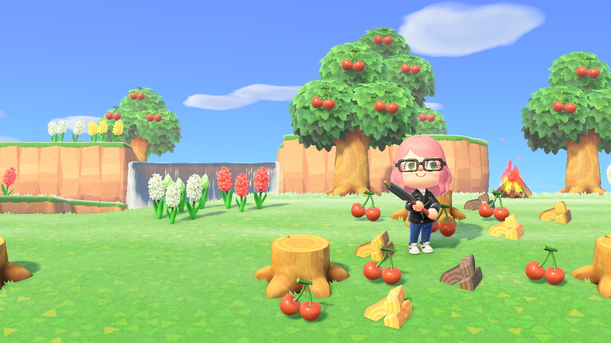

Early on in my ACNH journey, I was going on Nook Miles Tours 2-3 times a day to hoard resources. I learned to make the most of these tickets by doing the following:

### 1. Only bring your tools.

Before leaving your island, empty your pockets of _everything_ except your tools (minus your watering can). Make sure you have an iron axe. I will explain why a little later.

### 2. Go around the island shaking trees.

There's almost always a furniture item hiding in the trees on a mystery island tour, which is a huge bonus. But, it's also a good idea to shake trees before you chop them down in case there are wasps! So, remember to keep your net at hand.

### 3. Chop down trees.

I like to use the iron axe for this so I have the ability to control how many trees/stumps I have laying around.

### 4a. If the fruit is a sister fruit, take it _all._

Sister fruits will sell for 500 Bells EACH. You can stack them up to 10 in your pockets, meaning each slot is 5000 Bells.

### 4b. If the fruit is your island fruit, take 10.

I look at each slot as Bells.
