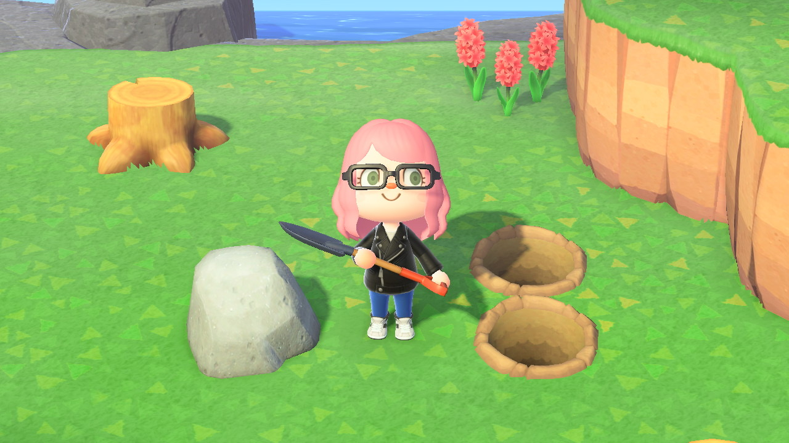

### 1. Start planning your dream island early...

While you _can_ decide to move buildings and bridges/inclines later on in the game (for a price), it would'be been nice to have planned things out a little more carefully. Going in, I just wanted myself and my 2 villagers to have as much space as possible.
Was I thinking ahead, and planning to house 10 villagers, 2 stores and a museum? Not at all. If I were, I would've saved a lot of Bells.

### 2. You will share an island with anyone you share your Switch with.

I did not realize this until my boyfriend was all of the sudden pitching a tent on Unchartia! So just keep in mind, if you are in a similar situation, you will need to account for 12 houses, 2 stores and a museum in your island planning!

### 3. You can (and should!) be picky with the villagers you choose to let live on your island.

Some villagers just aren't created as equally as others. Do a little research on potential villagers when you come across them on mystery island tours or your campsite. Don't just fill up those 10 spots on your island with anybody! It will be extremely hard to get rid of villagers you don't like. Take it from me, I'm stuck with Canberra, the ugliest koala bear I have ever seen.

### 4. Maximize your rock's resources by digging holes behind them.

You can hit each rock up to 8 times-- IF you don't get thrown around. You can maximize your rock's resources by simply digging two holes behind you, then hitting the rock 8 times in a row. Even if you are all good on building materials, you'll want to hit rocks daily as there's 16, 100 Bells hidden in one of the rocks on your island each and every day!

### 5. Don't eat more fruit than necessary...

Eating fruit gives you super-strength, so you are able to dig up trees or destroy rocks, which is very convinient _when_ you want to move things around! But, occasionally you will forget you've eaten fruit, and accidentally destroy the rock you were planning on mining :(. I suggest only eating as many pieces of fruits as absolutely necessary at one time, or you will have to wait for rocks to respawn (the next day).

### 6. Shake trees- with your net in hand! You will find Bells, furniture... and wasps.

Trees don't just provide you with branches and wood in New Horizons-- if you shake them, they occasionally have Bells and furniture items hiding inside! ... Or wasps, so I recommend shaking them with your trusty net in hand, so you can be ready for the little buggers. Catch them by facing the wasps direction and pressing A quite swiftly. They will get you 2500 Bells at Nook's Cranny!

### 7. Move carefully.

While you might think it is worthwhile to run (hold B) everywhere across your island, doing so puts you at risk of scaring bugs and fish-- and ruining flowers... so, just be mindful!

You should also know holding A while holding your net allows you to sneak up on critters! Once you release A, your net releases in the direction you were facing.

### 8. Check your Nookphone for Nook Miles updates regularly!

This is especially important with Nook Miles +, as these are tasks you are doing several times a day. You will only collect Nook Miles once you have cleared your notifications. So if you are like me and you have no problem with waiting hours to check the notifications on your phone... you'll need to kick your butt into shape so you can make the most of those Nook Miles.
